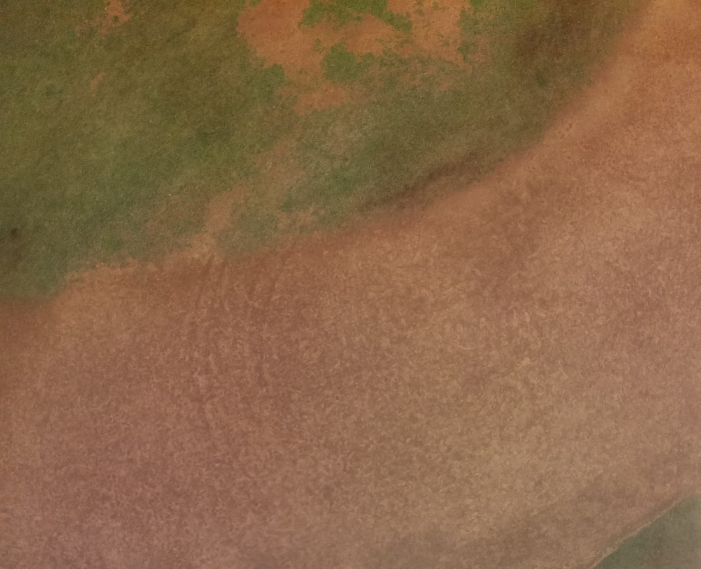

This article is on a research paper to identify plastic using reflactance values from multispectral images. Github repository to the complete research can be found [here](https://github.com/Deceptrax123/Plastic-Detection-using-Reflectance-Images-of-Hyperspectral-Bands)

#### What is multispectral images? 

Multispectral images are images that contain data across the electromagnetic spectrum. Our human eye is capable of capturing light in the wavelegth of 380 to 700 nanometers. Multispectral cameras can capture images in range of 400 to 1000 nanometers. 

#### What tech did we use?

We made use of a [DJI P4 multispectral](https://www.dji.com/global/p4-multispectral) drone which was equipped with a multispectral camera. This camera is capable of giving us 6 images as output (each of 2MP):

1. Regular RGB image
2. Red image
3. Green image
4. Blue image
5. Red edge image
6. Near-Infrared image

Below given are 6 images of the same scene

<figure>
    
    <figcaption>Fig 1. RGB image</figcaption>
</figure>
<figure>
    
    <figcaption>Fig 2. Red image</figcaption>
</figure>
<figure>
    
    <figcaption>Fig 3. Green image</figcaption>
</figure>
<figure>
    
    <figcaption>Fig 4. Blue image</figcaption>
</figure>
<figure>
    
    <figcaption>Fig 5. Red-Edge image</figcaption>
</figure>
<figure>
    
    <figcaption>Fig 1. Near-Infrared (NIR) image</figcaption>
</figure>